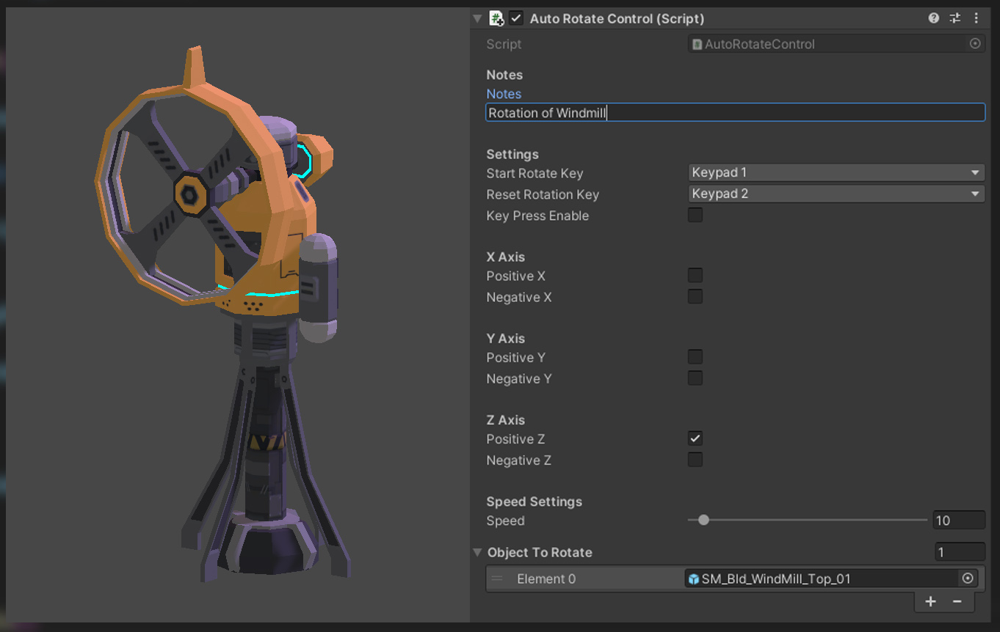

<h3 align="center">Auto Rotate Control</h3>

<!-- PROJECT LOGO -->

Easy to use Unity's GameObject Auto Rotate Control.

<!-- TABLE OF CONTENTS -->

  
Table of Contents

  <ol>
    <li><a href="#about">About</a></li>
    <li><a href="#functions">Functions</a></li>
    <li><a href="#getting-started">Getting Started</a></li>
    <li><a href="#example">Example</a></li>
    <li><a href="#contact">Contact</a></li>
  </ol>

<!-- ABOUT THE PROJECT -->
## About

Too tired of creating a simple rotating animation for a single gameobject?
 
Realizing that you need to create the same rotating animation for another gameobject?
 
Me too, that is why I created this simple to use Auto Rotate Control script.

<!-- FUNCTIONS -->
## Functions

* Instant rotation of GameObjects.
* Add as many objects that you want to rotate together.
* Assign keys to rotate and reset the rotation.
* Adjust the speed of the rotation.

<!-- GETTING STARTED -->
## Getting Started

* Create an empty GameObject and rename it to AutoRotateControl.
* Attach the AutoRotateControl.cs script to the GameObject.
* Add as many objects that you want to rotate together in the same script by adding them to the Object To Rotate list.
* If you want to rotate the object/objects on key press, simply check the Key Press Enable and select the keys you wish to use.
* Adjust the speed by moving the slider.
* Add notes on top to keep track of the objects that you AutoRotate.
* Press Play in your editor and all the objects you had assigned will now rotate according to your settings.

<!-- USAGE EXAMPLES -->
## Example

Simply add the script to any GameObject and set the properties.

<!-- CONTACT -->
## Contact

Twitter: [@its_danisauraus](https://twitter.com/its_danisauraus)
 
LinkedIn: [Hamdan Basri](https://www.linkedin.com/in/hamdanbasri/)

(<a href="#readme-top">back to top</a>)

